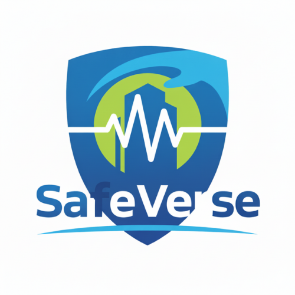
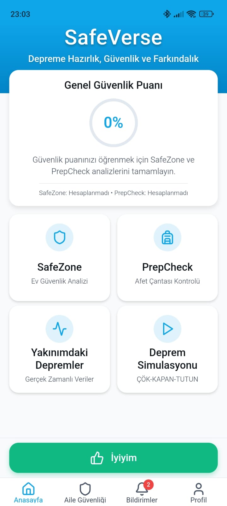
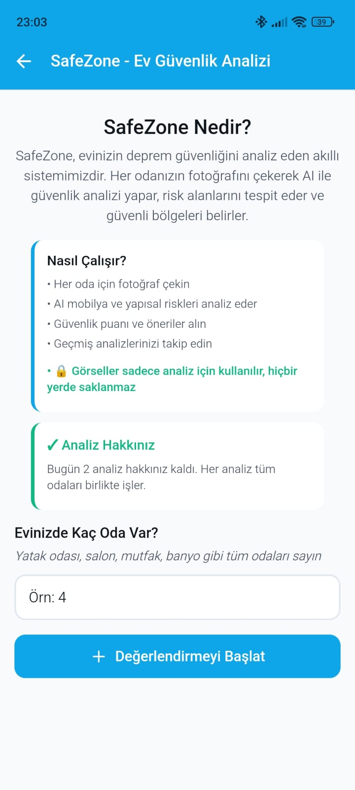
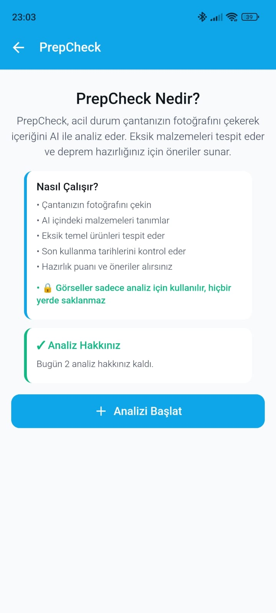
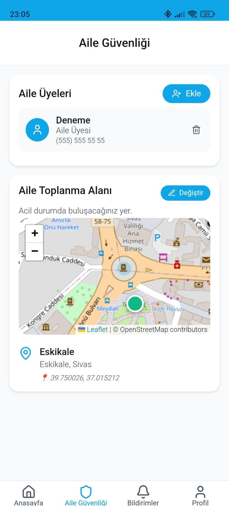
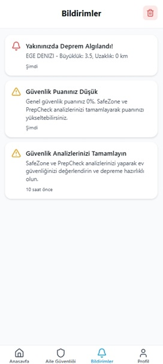
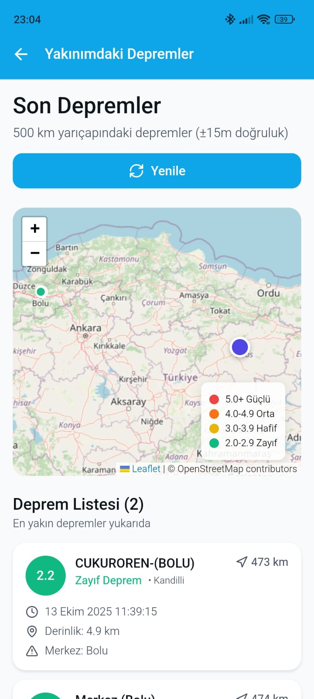
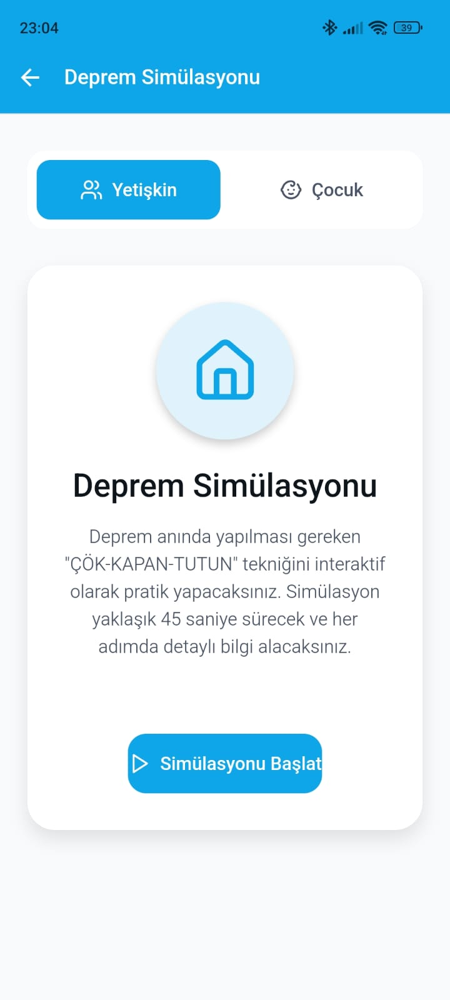

# SafeVerse - Deprem Güvenliği Uygulaması

<div align="center">



**Kapsamlı bir deprem hazırlığı ve güvenlik platformu**

[](https://opensource.org/licenses/MIT)
[](https://www.docker.com/)
[](https://expo.dev/)
[](https://dotnet.microsoft.com/)

---

🚀 **[Canlı Uygulamayı Deneyin: safeverse.tech](https://safeverse.tech)**

</div>

---

## 📋 İçindekiler

- [Proje Hakkında](#-proje-hakkında)
- [Özellikler](#-özellikler)
- [Proje Yapısı](#-proje-yapısı)
- [Teknoloji Yığını](#-teknoloji-yığını)
- [Gereksinimler](#-gereksinimler)
- [Kurulum](#-kurulum)
- [Ortam Değişkenleri](#-ortam-değişkenleri)
- [Geliştirme](#-geliştirme)
- [Deployment](#-deployment)
- [Geliştirici Ekibi](#-geliştirici-ekibi)
- [Lisans](#-lisans)

---

## 🌟 Proje Hakkında

SafeVerse, depreme karşı hazırlıklı olmak ve deprem anında doğru kararlar almak için geliştirilmiş kapsamlı bir mobil ve web uygulamasıdır. Yapay zeka destekli ev güvenlik analizi, acil durum çantası yönetimi, aile üyesi takibi ve gerçek zamanlı deprem bildirimleri gibi özelliklerle kullanıcıların deprem güvenliğini artırmayı hedefler.

### Uygulama Ekran Görüntüleri

<div align="center">

</div>

---

## ✨ Özellikler

### 🏠 SafeZone - Ev Güvenlik Analizi
- **AI Destekli Analiz**: Evinizin her odasının fotoğrafını çekerek yapay zeka ile güvenlik analizi yapın
- **Oda Bazlı Değerlendirme**: Her oda için ayrı risk değerlendirmesi ve güvenlik skoru
- **Güvenli Bölgeler**: Deprem anında sığınabileceğiniz güvenli alanların belirlenmesi
- **Risk Tespiti**: Sabitlenmemiş mobilyalar, cam yüzeyler gibi potansiyel tehlikelerin tespiti
- **Aksiyon Önerileri**: Tespit edilen riskler için somut çözüm önerileri

<div align="center">

</div>

### 🎒 PrepCheck - Acil Durum Çantası
- **Hazır Kontrol Listesi**: Deprem çantasında bulunması gereken tüm malzemelerin listesi
- **Kategori Bazlı Organizasyon**: Gıda, ilk yardım, araç-gereç gibi kategoriler
- **Son Kullanma Takibi**: Gıda ve ilaçlar için son kullanma tarihi uyarıları
- **İlerleme Takibi**: Hazırlık durumunuzun yüzdelik görünümü
- **Özel Ekleme**: Kendi malzemelerinizi listeye ekleme

<div align="center">

</div>

### 👨‍👩‍👧‍👦 Aile Güvenlik Takibi
- **Aile Üyeleri**: Aile üyelerinizi ve acil durum kişilerini kaydedin
- **Güvenlik Durumu**: Her üyenin güvenlik durumunu gerçek zamanlı takip edin
- **Toplu SMS**: Deprem anında tüm aile üyelerine konumunuzu içeren SMS gönderin
- **Buluşma Noktası**: Deprem sonrası buluşma noktası belirleme ve paylaşma
- **Konum Paylaşımı**: Anlık konum bilgisi paylaşımı

<div align="center">

</div>

### 🚨 Gerçek Zamanlı Deprem Bildirimleri
- **Anlık Uyarılar**: Konumunuza yakın depremler için anında bildirim
- **Kandilli Verisi**: Kandilli Rasathanesi'nin gerçek zamanlı deprem verileri
- **Mesafe Filtreleme**: 150km yarıçapındaki depremler için uyarı
- **Büyüklük Eşiği**: 3.0 ve üzeri büyüklükteki depremler
- **Bildirim Geçmişi**: Geçmiş deprem bildirimlerini görüntüleme

<div align="center">

</div>

<div align="center">

</div>

### 🎮 Deprem Simülasyonu
- **Etkileşimli Eğitim**: Deprem anında ne yapılması gerektiğini öğrenin
- **Senaryolar**: Farklı ortamlar için deprem senaryoları
- **Doğru/Yanlış Kararlar**: Verdiğiniz kararların sonuçlarını görün
- **Eğitici İçerik**: Deprem güvenliği hakkında bilgilendirici içerikler

<div align="center">

</div>

### 📊 Güvenlik Skoru
- **Kapsamlı Değerlendirme**: SafeZone ve PrepCheck skorlarının birleşimi
- **İlerleme Takibi**: Zamanla güvenlik skorunuzun gelişimini izleyin
- **Görsel Göstergeler**: Renkli ve anlaşılır güvenlik skorları
- **Kişiselleştirilmiş Öneriler**: Skorunuzu artırmak için özel öneriler

---

## 📁 Proje Yapısı

### Genel Mimari

SafeVerse, **monorepo** yapısında geliştirilmiş fullstack bir uygulamadır. Frontend ve backend aynı repository içinde organize edilmiştir.

```
SafeVerse/
├── frontend/                     # Frontend - React Native/Expo uygulaması
│   ├── app/                     # Expo Router sayfaları
│   ├── components/              # Yeniden kullanılabilir React bileşenleri
│   ├── contexts/                # React Context API - State yönetimi
│   ├── lib/                     # Yardımcı fonksiyonlar ve API client
│   ├── services/                # API servis katmanı
│   ├── utils/                   # Yardımcı fonksiyonlar
│   ├── assets/                  # Görseller, fontlar, medya dosyaları
│   ├── Dockerfile.web           # Web uygulaması Docker build
│   └── package.json             # Frontend bağımlılıkları
├── backend/                      # Backend - ASP.NET Core Web API
│   └── SafeVerse.Api/           # API projesi
│       ├── Controllers/         # API endpoint'leri
│       ├── Models/              # Database entity'leri
│       ├── Services/            # Business logic
│       ├── Data/                # Database context
│       ├── Middleware/          # Custom middleware'ler
│       ├── Configuration/       # Yapılandırma sınıfları
│       └── Program.cs           # Uygulama giriş noktası
├── docker-compose.yml           # Multi-container orchestration
├── CLAUDE.md                    # AI asistan talimatları
└── .env.example                 # Ortam değişkenleri şablonu
```

### Frontend Yapısı (React Native / Expo)

```
frontend/
├── app/                        # Expo Router sayfaları
│   ├── (tabs)/                 # Tab navigation ekranları
│   │   ├── index.tsx          # Ana sayfa (Dashboard)
│   │   ├── family.tsx         # Aile üyeleri sayfası
│   │   ├── profile.tsx        # Profil ve ayarlar
│   │   └── notifications.tsx  # Bildirimler
│   ├── login.tsx              # Giriş ekranı
│   ├── register.tsx           # Kayıt ekranı
│   ├── home-security.tsx      # SafeZone ev analizi
│   ├── emergency-bag.tsx      # PrepCheck çanta yönetimi
│   ├── nearby-earthquakes.tsx # Yakındaki depremler
│   ├── earthquake-simulation.tsx # Deprem simülasyonu
│   └── _layout.tsx            # Root layout ve provider hierarchy
├── components/                 # Yeniden kullanılabilir React bileşenleri
│   ├── ui/                    # Temel UI bileşenleri
│   │   ├── Button.tsx
│   │   ├── Card.tsx
│   │   └── Input.tsx
│   ├── SafeZoneCard.tsx       # SafeZone özellik kartı
│   ├── PrepCheckCard.tsx      # PrepCheck özellik kartı
│   ├── FamilyMemberCard.tsx   # Aile üyesi kartı
│   └── NotificationBanner.tsx # Bildirim banner'ı
├── contexts/                   # React Context API - State yönetimi
│   ├── AuthContext.tsx        # Kimlik doğrulama ve kullanıcı state
│   ├── LocationContext.tsx    # GPS takibi ve deprem kontrolü
│   ├── NotificationContext.tsx # Push notification yönetimi
│   ├── FamilyContext.tsx      # Aile üyeleri yönetimi
│   ├── SafeZoneContext.tsx    # Ev güvenlik analizi state
│   └── EmergencyBagContext.tsx # Acil durum çantası state
├── lib/                       # Yardımcı fonksiyonlar ve API client
│   ├── api.ts                 # Axios HTTP client
│   ├── storage.ts             # AsyncStorage wrapper
│   └── utils.ts               # Yardımcı fonksiyonlar
├── services/                   # API servis katmanı
├── utils/                      # Yardımcı fonksiyonlar
├── assets/                     # Görseller, fontlar, medya dosyaları
├── web/                        # Web'e özgü dosyalar
├── Dockerfile.web              # Web uygulaması Docker build
├── nginx.conf                  # Nginx yapılandırması
├── package.json                # Bağımlılıklar ve scriptler
└── tsconfig.json               # TypeScript yapılandırması
```

### Backend Yapısı (ASP.NET Core 8)

```
backend/SafeVerse.Api/
├── Controllers/                # API endpoint'leri
│   ├── AuthController.cs      # Kimlik doğrulama (register, login, profile)
│   ├── FamilyController.cs    # Aile üyeleri yönetimi
│   ├── SafetyController.cs    # SafeZone AI analizi
│   ├── EmergencyController.cs # PrepCheck çanta yönetimi
│   ├── EarthquakesController.cs # Deprem verileri
│   └── HealthController.cs    # Health check endpoint
├── Models/                     # Database entity'leri
│   ├── User.cs                # Kullanıcı modeli
│   ├── FamilyMember.cs        # Aile üyesi modeli
│   └── MeetingPoint.cs        # Buluşma noktası modeli
├── Services/                   # Business logic ve servisler
│   ├── JwtTokenService.cs     # JWT token oluşturma
│   ├── PasswordHasher.cs      # Şifre hash'leme
│   └── LlmClientFactory.cs    # AI servis yönetimi
├── Middleware/                 # Custom middleware'ler
│   └── SecurityHeadersMiddleware.cs
├── Configuration/              # Yapılandırma sınıfları
│   ├── LoggingConfiguration.cs
│   └── RateLimitConfiguration.cs
├── Data/
│   └── AppDbContext.cs        # Entity Framework DbContext
├── Migrations/                 # Database migration'ları
├── Program.cs                  # Uygulama giriş noktası
└── appsettings.json           # Yapılandırma dosyası
```

### Context Hierarchy (Önemli!)

Frontend'de React Context'ler belirli bir hiyerarşide organize edilmiştir. **Bu sıralama kritiktir** çünkü bazı context'ler diğerlerine bağımlıdır:

```typescript
SafeAreaProvider
└── ThemeProvider
    └── NavigationBlockerProvider
        └── AuthProvider                  // 1. Kimlik doğrulama
            └── ProtectedRoute           // 2. Route koruma
                └── SafeZoneProvider     // 3. Ev güvenlik analizi
                    └── EmergencyBagProvider  // 4. Çanta yönetimi
                        └── NotificationProvider  // 5. Bildirimler
                            └── LocationProvider  // 6. GPS ve deprem takibi
                                └── FamilyProvider  // 7. Aile üyeleri
                                    └── App Content
```

**Bağımlılıklar**:
- `LocationProvider` → `AuthProvider` (API token için)
- `NotificationProvider` → `LocationProvider` (Yakın deprem kontrolü)
- `FamilyProvider` → `LocationProvider` (Konum paylaşımı)

### API Endpoint'leri

#### Authentication (`/api/auth`)
- `POST /register` - Yeni kullanıcı kaydı
- `POST /login` - Giriş yap (JWT token döner)
- `GET /profile` - Kullanıcı profili
- `PUT /profile` - Profil güncelle
- `POST /location` - Kullanıcı konumu güncelle

#### Family (`/api/family`)
- `GET /members` - Aile üyelerini listele
- `POST /members` - Yeni aile üyesi ekle
- `DELETE /members/{id}` - Aile üyesi sil
- `POST /safety-status` - Güvenlik durumu güncelle
- `POST /meeting-point` - Buluşma noktası oluştur

#### Safety (`/api/safety`)
- `POST /analyze-image` - Tek oda analizi (AI)
- `POST /analyze-rooms` - Çoklu oda analizi (AI)
- `GET /hazards` - Tespit edilen tehlikeler
- `POST /hazards` - Yeni tehlike ekle
- `PATCH /hazards/{id}` - Tehlike durumu güncelle

#### Emergency Bag (`/api/emergency`)
- `GET /items` - Çanta malzemelerini listele
- `POST /items` - Yeni malzeme ekle
- `PUT /items/{id}` - Malzeme güncelle
- `PATCH /items/{id}` - Malzeme işaretle
- `GET /checklist` - Hazır kontrol listesi

#### Earthquakes (`/api/earthquakes`)
- `GET /nearby?lat=x&lng=y&radius=150` - Yakındaki depremler

---

## 🛠️ Teknoloji Yığını

### Frontend

| Teknoloji | Versiyon | Kullanım Amacı |
|-----------|----------|----------------|
| **React Native** | 0.81.4 | Cross-platform mobil uygulama |
| **Expo** | ~54.0.0 | Development framework ve build tools |
| **TypeScript** | ~5.9.2 | Type-safe development |
| **Expo Router** | ~6.0.7 | File-based routing |
| **React Context API** | - | State management |
| **Axios** | ^1.7.7 | HTTP istekleri |
| **AsyncStorage** | 2.2.0 | Local data persistence |
| **Expo Location** | ~19.0.0 | GPS tracking |
| **Expo Notifications** | ^0.32.11 | Push notifications |
| **Expo SMS** | ~14.0.0 | SMS gönderimi |
| **React Native Maps** | 1.20.1 | Harita entegrasyonu |
| **Lucide React Native** | ^0.475.0 | İkonlar |

### Backend

| Teknoloji | Versiyon | Kullanım Amacı |
|-----------|----------|----------------|
| **ASP.NET Core** | 8.0 | Web API framework |
| **C#** | 12.0 | Backend programlama dili |
| **Entity Framework Core** | 8.0 | ORM (Object-Relational Mapping) |
| **PostgreSQL** | 14 | İlişkisel veritabanı |
| **JWT Bearer** | - | Authentication |
| **Npgsql** | - | PostgreSQL driver |

### AI/LLM Servisleri

| Servis | Kullanım | Fallback |
|--------|----------|----------|
| **Üçüncü Taraf LLM** | Birincil AI servisi | ✅ Gemini |
| **Google Gemini** | Fallback AI servisi | ✅ Mock data |
| **Mock LLM** | Development/Test | - |

**AI Provider Seçenekleri**:
- `fallback` (önerilen): Üçüncü taraf LLM → Gemini → Mock
- `http`: Sadece üçüncü taraf LLM
- `gemini`: Sadece Google Gemini
- `mock`: Test için mock data

### Infrastructure

| Teknoloji | Kullanım Amacı |
|-----------|----------------|
| **Docker** | Containerization |
| **Docker Compose** | Multi-container orchestration |
| **Nginx** | Static file serving (web) |
| **PostgreSQL 14** | Database |

### External APIs

| API | Kullanım |
|-----|----------|
| **Kandilli Rasathanesi API** | Gerçek zamanlı deprem verileri |
| **Google Gemini API** | AI-powered güvenlik analizi |

---

## 📦 Gereksinimler

### Docker ile Çalıştırma (Önerilen)

- **Docker** 20.10+
- **Docker Compose** 2.0+
- **Git**

### Manuel Kurulum için

- **Node.js** 18+ ve **npm**
- **Bun** (opsiyonel, daha hızlı build için)
- **.NET 8 SDK**
- **PostgreSQL** 14+

---

## 🚀 Kurulum

### 1. Repository'yi Klonlayın

```bash
git clone https://github.com/burakarslan0110/SafeVerse.git
cd SafeVerse
```

### 2. Ortam Değişkenlerini Yapılandırın

```bash
# .env.example dosyasını kopyalayın
cp .env.example .env

# .env dosyasını düzenleyin
nano .env  # veya tercih ettiğiniz editör
```

⚠️ **ÖNEMLİ**: `.env` dosyasındaki **tüm zorunlu değişkenleri** doldurmanız gerekmektedir. [Ortam Değişkenleri](#-ortam-değişkenleri) bölümüne bakın.

### 3. Docker Compose ile Başlatın

```bash
# Tüm servisleri build edin ve başlatın (PostgreSQL + API + Web)
docker-compose up --build

# Veya arka planda çalıştırın
docker-compose up -d --build
```

İlk başlatma 5-10 dakika sürebilir (bağımlılıklar indirilecek ve build edilecek).

### 4. Uygulamaya Erişin

- **Web Uygulaması**: http://localhost:3000
- **Backend API**: http://localhost:8080
- **API Health Check**: http://localhost:8080/health
- **Database**: localhost:5432 (sadece docker içinden erişilebilir)

### 5. İlk Kullanıcıyı Oluşturun

1. Web uygulamasını açın: http://localhost:3000
2. "Kayıt Ol" butonuna tıklayın
3. Ad, e-posta ve şifre girin
4. Giriş yapın ve uygulamayı kullanmaya başlayın!

---

## 🔧 Ortam Değişkenleri

SafeVerse'ün çalışması için **toplam 21 ortam değişkeni** mevcuttur. Bunların bir kısmı zorunlu, bir kısmı opsiyoneldir.

### Zorunlu Değişkenler

| Değişken | Açıklama | Örnek |
|----------|----------|-------|
| `EXPO_PUBLIC_API_BASE_URL` | Backend API URL'i (**ÖNEMLİ**: `/api` suffix'i eklemeyin) | `http://localhost:8080` |
| `POSTGRES_DB` | Veritabanı adı | `safeverse` |
| `POSTGRES_USER` | Veritabanı kullanıcı adı | `postgres` |
| `POSTGRES_PASSWORD` | Veritabanı şifresi (min 16 karakter) | `güçlü_şifre_123456` |
| `DATABASE_URL` | PostgreSQL connection string | `Host=db;Database=safeverse;Username=postgres;Password=güçlü_şifre_123456;Port=5432` |
| `JWT_SECRET_KEY` | JWT imzalama anahtarı (min 32 karakter) | `openssl rand -base64 32` ile oluşturun |
| `JWT_ISSUER` | JWT issuer | `SafeVerse` |
| `JWT_AUDIENCE` | JWT audience | `SafeVerseClient` |
| `CORS_ORIGIN_1` | İzin verilen frontend origin | `http://localhost:3000` |

### Opsiyonel Değişkenler

| Değişken | Açıklama | Default |
|----------|----------|---------|
| `CORS_ORIGIN_2` | İlave frontend origin | - |
| `CORS_ORIGIN_3` | İlave frontend origin | - |
| `LLM_PROVIDER` | AI provider (`fallback`, `http`, `gemini`, `mock`) | `fallback` |
| `LLM_ENDPOINT` | Üçüncü taraf LLM endpoint | - |
| `GEMINI_API_KEY` | Google Gemini API key ([buradan alın](https://aistudio.google.com/app/apikey)) | - |
| `GEMINI_MODEL` | Gemini model (`gemini-2.0-flash-exp`, `gemini-1.5-pro`) | `gemini-2.0-flash-exp` |
| `ASPNETCORE_ENVIRONMENT` | Backend ortamı (`Development`, `Production`) | `Production` |
| `NODE_ENV` | Node ortamı (`development`, `production`) | `production` |

### Deployment Platform Değişkenleri (Opsiyonel)

Coolify, Railway, Render gibi platformlar için:

| Değişken | Açıklama |
|----------|----------|
| `SERVICE_FQDN_API` | API servis domain'i |
| `SERVICE_FQDN_WEB` | Web servis domain'i |
| `SERVICE_URL_API` | API servis URL'i |
| `SERVICE_URL_WEB` | Web servis URL'i |

### Güvenlik Notları

🔒 **Kritik Güvenlik Gereksinimleri**:

1. **Asla `.env` dosyasını version control'e commit etmeyin**
2. **Güçlü şifreler kullanın**:
   ```bash
   # PostgreSQL şifresi oluşturma
   openssl rand -base64 24

   # JWT secret oluşturma
   openssl rand -base64 32
   ```
3. **Production'da HTTPS kullanın**: `EXPO_PUBLIC_API_BASE_URL=https://...`
4. **CORS'u kısıtlayın**: Production'da sadece gerçek domain'lerinizi ekleyin
5. **Environment değişkenlerini güvenli saklayın**: Docker secrets, vault vb.

### Örnek .env Dosyası

```bash
# Frontend
EXPO_PUBLIC_API_BASE_URL=http://localhost:8080

# Database
POSTGRES_DB=safeverse
POSTGRES_USER=postgres
POSTGRES_PASSWORD=super_guclu_sifre_123456789
DATABASE_URL=Host=db;Database=safeverse;Username=postgres;Password=super_guclu_sifre_123456789;Port=5432

# JWT
JWT_SECRET_KEY=cok_uzun_ve_guclu_jwt_secret_key_en_az_32_karakter_olmali
JWT_ISSUER=SafeVerse
JWT_AUDIENCE=SafeVerseClient

# CORS
CORS_ORIGIN_1=http://localhost:3000
CORS_ORIGIN_2=https://safeverse.com
CORS_ORIGIN_3=https://www.safeverse.com

# AI/LLM (Opsiyonel)
LLM_PROVIDER=fallback
GEMINI_API_KEY=AIzaSyXXXXXXXXXXXXXXXXXXXXXXXX
GEMINI_MODEL=gemini-2.0-flash-exp

# Environment
ASPNETCORE_ENVIRONMENT=Production
NODE_ENV=production
```

---

## 💻 Geliştirme

### Frontend Geliştirme

Geliştirme komutları proje kökünden (root) kullanılabilir (frontend bağımlılıkları root `package.json` içinde):

```bash
# Bağımlılıkları yükle
npm install

# Expo dev server'ı başlat
npm start

# Platform-specific başlatma
npm run android   # Android emulator/device
npm run ios       # iOS simulator/device
npm run web       # Web browser

# Linting
npm run lint

# Backend servislerini başlat (PostgreSQL + API)
npm run dev:compose
```

### Backend Geliştirme

Backend, docker-compose üzerinden Docker içinde çalışır. Manuel geliştirme için:

```bash
cd backend/SafeVerse.Api

# Bağımlılıkları yükle
dotnet restore

# Development modunda çalıştır
dotnet run

# Migration oluştur
dotnet ef migrations add MigrationName

# Migration uygula
dotnet ef database update
```

**Not**: Migration'lar uygulama başlangıcında `Program.cs` aracılığıyla otomatik olarak retry mekanizması ile uygulanır.

### Docker ile Geliştirme

```bash
# Servisleri başlat
docker-compose up

# Logları izle
docker-compose logs -f api
docker-compose logs -f web
docker-compose logs -f db

# Belirli bir servisi rebuild et
docker-compose up --build api

# Servisleri durdur
docker-compose down

# Volume'ları sil (DİKKAT: Veritabanı silinir!)
docker-compose down -v

# Container'a shell ile bağlan
docker-compose exec api sh
docker-compose exec db psql -U postgres -d safeverse
```

---

## 🌐 Deployment

### Production Checklist

- [ ] Güçlü `POSTGRES_PASSWORD` belirle (min 16 karakter)
- [ ] Güvenli `JWT_SECRET_KEY` oluştur (min 32 karakter)
- [ ] `CORS_ORIGIN_*` değişkenlerine gerçek domain'leri ekle
- [ ] `EXPO_PUBLIC_API_BASE_URL` için HTTPS kullan
- [ ] `ASPNETCORE_ENVIRONMENT=Production` ayarla
- [ ] `NODE_ENV=production` ayarla
- [ ] `GEMINI_API_KEY` yapılandır (AI fallback için)
- [ ] PostgreSQL için otomatik backup kur
- [ ] Monitoring ve alerting ayarla
- [ ] SSL sertifikası yapılandır
- [ ] Firewall kurallarını ayarla

### Desteklenen Deployment Platformları

SafeVerse aşağıdaki platformlarda deploy edilebilir:

- **Coolify** (self-hosting için önerilen)
- **Railway**
- **Render**
- **Fly.io**
- **DigitalOcean App Platform**
- **AWS ECS / Fargate**
- **Azure Container Apps**
- **Google Cloud Run**
- **Herhangi bir Docker uyumlu platform**

### Environment Bazlı Davranışlar

**Development Modu** (`ASPNETCORE_ENVIRONMENT=Development`):
- ✅ Swagger UI aktif
- ✅ Detaylı error logları
- ✅ Tüm origin'lere CORS açık
- ❌ Security headers yok
- ❌ HTTPS redirect yok

**Production Modu** (`ASPNETCORE_ENVIRONMENT=Production`):
- ❌ Swagger UI kapalı
- ✅ Kısıtlı CORS (sadece belirtilen origin'ler)
- ✅ Security headers aktif
- ✅ HSTS aktif
- ✅ Rate limiting aktif
- ⚠️ Sınırlı error detayları (güvenlik için)

---

## 👥 Geliştirici Ekibi

SafeVerse, **GreenNimbus** ekibi tarafından **BTK Akademi & Huawei Ar-Ge Kodlama Maratonu'25** için geliştirilmiştir.

### Takım Üyeleri

#### 👨‍💻 Burak Arslan - Frontend & Backend Geliştirici
**Fullstack geliştirici** olarak projenin tüm teknik altyapısını geliştirdim. React Native/Expo ile cross-platform mobil uygulama, ASP.NET Core ile backend API, PostgreSQL veritabanı tasarımı ve Docker ile deployment süreçlerini yönettim. AI entegrasyonu, real-time bildirim sistemi ve GPS tabanlı deprem takibi özelliklerini hayata geçirdim. Yarışma sonrası Coolify ile Azure VM üzerinde production deployment'ı gerçekleştirdim.

[](https://www.linkedin.com/in/burakarslann0110/)
[](https://github.com/burakarslan0110)

#### 🎯 Enes Cıkcık - Takım Kaptanı & Cloud Planner
**Takım kaptanı** olarak proje yönetimi, Kodlama Maratonu25'de Huawei Cloud infrastructure planlama ve deployment stratejilerini belirledi.

[](https://www.linkedin.com/in/enescikcik/)

#### 🔬 Saadet Elizaveta Babal - Teknik Araştırmacı & Cloud
**Teknik araştırmacı** olarak deprem verisi kaynaklarının araştırılması, AI/LLM servislerinin karşılaştırılması ve Huawei Cloud infrastructure optimizasyonunu sağladı.

[](https://www.linkedin.com/in/saadetelizavetababal/)

---

## 📄 Lisans

Bu proje MIT Lisansı altında lisanslanmıştır - detaylar için [LICENSE](LICENSE) dosyasına bakın.

---

## 🙏 Teşekkürler

- **Kandilli Rasathanesi ve Deprem Araştırma Enstitüsü** - Gerçek zamanlı deprem verileri
- **Orhan Aydoğdu** - [Kandilli Rasathanesi API](https://github.com/orhanayd/kandilli-rasathanesi-api) geliştiricisi

---

## 📞 İletişim ve Destek

- **Issue Bildirimi**: [GitHub Issues](https://github.com/burakarslan0110/SafeVerse/issues)
- **Feature İsteği**: [GitHub Issues](https://github.com/burakarslan0110/SafeVerse/issues)
- **Katkıda Bulunma**: Pull request'ler memnuniyetle karşılanır!

---

<div align="center">

**Deprem güvenliği ve hazırlığı ile geliştirildi**

[⬆ Başa Dön](#safeverse---deprem-güvenliği-uygulaması)

</div>
